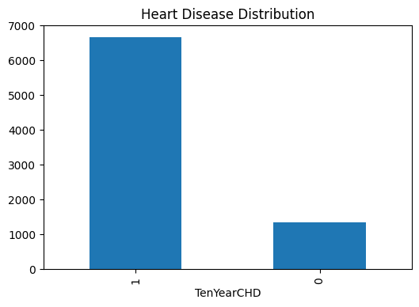
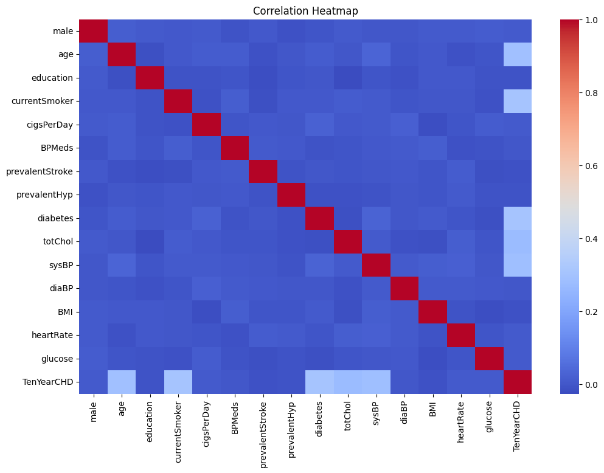
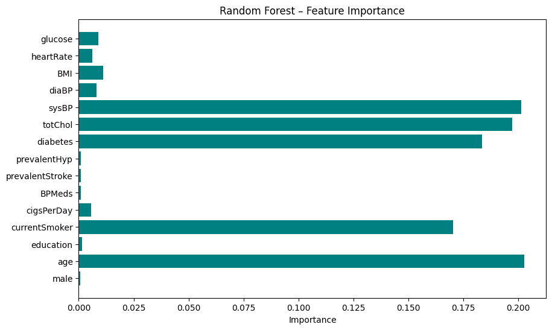
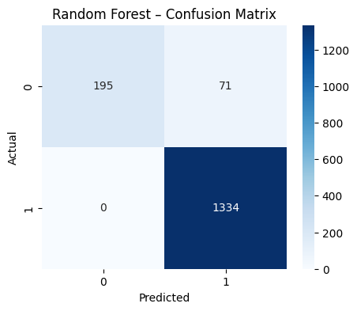
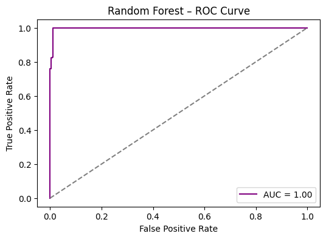
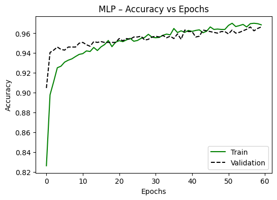

# AI-Based Clinical Risk Prediction for Cardiovascular Diseases

---

## Project Overview
This project focuses on predicting the risk of cardiovascular diseases using **Artificial Intelligence and Machine Learning techniques**. The system analyzes patient clinical and lifestyle data to identify individuals who may be at risk of developing heart disease.

Early prediction of cardiovascular disease can help healthcare professionals take preventive actions and improve patient outcomes.

---

## Objectives
- Predict cardiovascular disease risk using machine learning models
- Analyze clinical and lifestyle factors influencing heart disease
- Compare multiple machine learning algorithms
- Support early medical diagnosis

---

## Dataset
The dataset used in this project is derived from the **Framingham Heart Study**, a long-term cardiovascular cohort study.

### Dataset Features
- Age  
- Gender  
- Blood Pressure  
- Cholesterol Level  
- Body Mass Index (BMI)  
- Glucose Level  
- Smoking Status  
- Diabetes Status  
- Heart Disease Risk (Target Variable)

---

## Technologies Used
- Python  
- NumPy  
- Pandas  
- Matplotlib  
- Seaborn  
- Scikit-learn  
- TensorFlow / Keras  

---

## Machine Learning Models
The following models were implemented and evaluated:

- Logistic Regression  
- Random Forest  
- Support Vector Machine (SVM)  
- K-Nearest Neighbors (KNN)  
- Multi-Layer Perceptron (MLP)

---

## Project Workflow
1. Data Collection  
2. Data Preprocessing  
3. Feature Selection  
4. Model Training  
5. Model Evaluation  
6. Cardiovascular Risk Prediction  

---

## Evaluation Metrics
The models were evaluated using:

- Accuracy  
- Precision  
- Recall  
- F1 Score  
- ROC-AUC Score  

---

## Future Scope
- Integration with real-time healthcare systems  
- Deployment as a web-based prediction tool  
- Use of larger healthcare datasets  
- Implementation of advanced deep learning models  

---

---

## Screenshots

### Dataset Preview

### Correlation Heatmap

### featuring map

### Confusion Matrix

### ROC

### accuracyvsepochs

---
---

## Author
**Akash Antony**  
AI & Machine Learning Enthusiast
